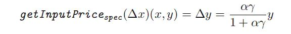
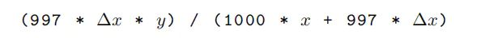
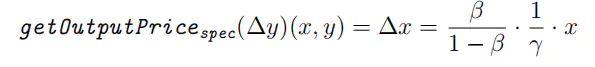
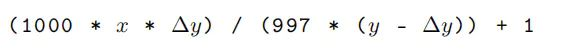

          
### 获取固定输入后的得出的 Token 数
**getInputPrice 公式**  
  

**Fee 率为 0.3% 计算**  


**Javascript 代码**
```
function  AMM_get_out_token (input , x, y, fee, tatolfee) {
    let _input  = new BigNumber( input)
    let _y = new BigNumber( y);
    let _x = new BigNumber( x);
    let _fee = new BigNumber(fee);
    let _tatolfee =new BigNumber( tatolfee)
    let output =  _tatolfee.minus(_fee).times(_input).times(_y).div(_tatolfee.times(_x).plus(_input.times(_tatolfee.minus(_fee))))
    return output;
}
``` 

### 获取固定输出所需要的 Token 数  
**getOutputPrice 公式**   
  

**Fee 率为 0.3% 计算**  
  

**Javascript 代码**
```
function AMM_get_in_token(output, x, y, fee, tatolfee){
    let _output  = new BigNumber( output)
    let _y = new BigNumber( y);
    let _x = new BigNumber( x);
    let _fee = new BigNumber(fee);
    let _tatolfee =new BigNumber( tatolfee)
    let input =  _tatolfee.times(_x).times(_output).div( _tatolfee.minus(_fee).times(_y.minus(_output)).plus(1) )

    return input;
}
``` 

### 完整代码例子
```
import BigNumber from "bignumber.js";

console.log(AMM_get_out_token("100000000000",
                               "13202014968050",
                               "4180422025569" ,
                               '3',
                               '1000').decimalPlaces(0, 1).div(new BigNumber(10).pow(9)).toString())


console.log(AMM_get_in_token("100000000000",
                            "13202014968050",
                            "4180422025569" ,
                            '3',
                            '1000').decimalPlaces(0, 1).div(new BigNumber(10).pow(9)).toString())
function  AMM_get_out_token (input ,x,y,fee,tatolfee) {
    let _input  = new BigNumber( input)
    let _y = new BigNumber( y);
    let _x = new BigNumber( x);
    let _fee = new BigNumber(fee);
    let _tatolfee =new BigNumber( tatolfee)
    let output =  _tatolfee.minus(_fee).times(_input).times(_y).div(_tatolfee.times(_x).plus(_input.times(_tatolfee.minus(_fee))))
    return output;
} 

function AMM_get_in_token(output,x,y,fee,tatolfee){
    let _output  = new BigNumber( output)
    let _y = new BigNumber( y);
    let _x = new BigNumber( x);
    let _fee = new BigNumber(fee);
    let _tatolfee =new BigNumber( tatolfee)
    let input =  _tatolfee.times(_x).times(_output).div( _tatolfee.minus(_fee).times(_y.minus(_output)).plus(1) )

    return input;
}
```